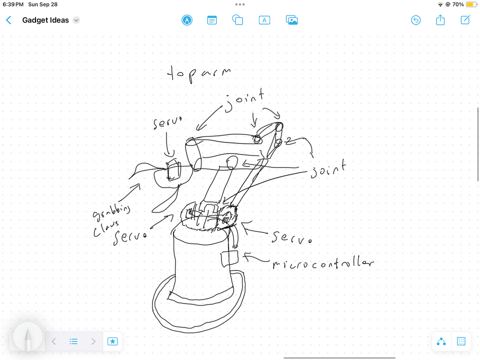

# TopArm !!

- on a tophat
- uses a joystick control
- grab small things off the top shelf if you're too short
- wave to friends
- controlled using arduino, servos connected to a pwm servo driver
- leds for some shiny bling
